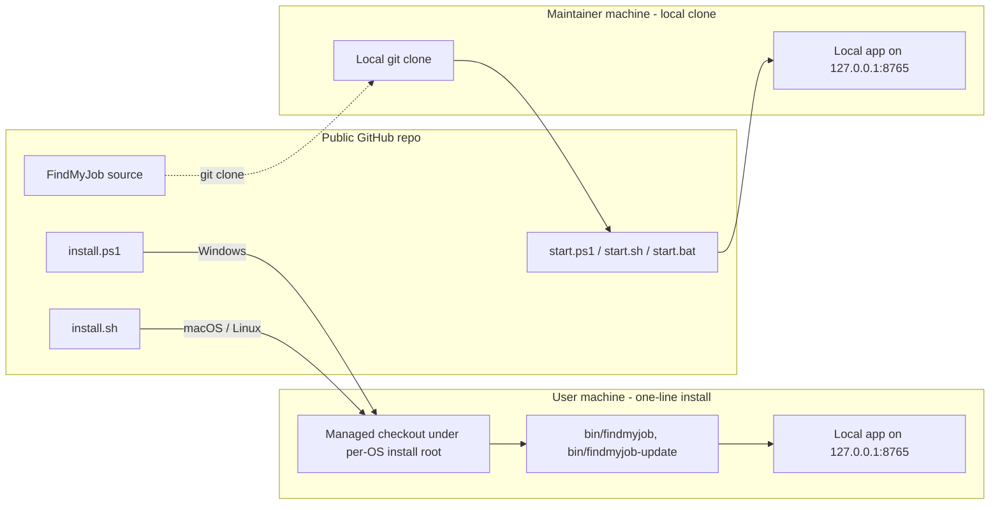

# FindMyJob

[](https://www.python.org/)
[](https://fastapi.tiangolo.com/)
[](https://react.dev/)
[](https://playwright.dev/)
[](https://lmstudio.ai/)
[](LICENSE)
[](#beta-launch-posture)

FindMyJob is a local-first job application operator for people who want a visible, configurable workflow instead of a black-box "AI apply bot."

It discovers jobs, screens them with a local model, drafts tailored application documents, fills forms in a real browser, and exposes the entire pipeline through a web UI built for an operator to supervise, approve, and recover edge cases.

## Current Beta Release

- Supported public launchers now bootstrap `.venv312` automatically on first run, install the editable project, and install Chromium for Playwright.
- Setup remains the reusable personal-profile bootstrap surface; Settings owns provider routing, automation, ChatGPT drafting, and the non-personal settings bundle.
- The dashboard now includes an optional inbox panel, and the Autopilot queue intentionally renders without a redundant search bar.
- Ledger exports write CSV and XLSX snapshots, preserve companion tracking files across reset, and can auto-export during autonomous flows.
- The project license is now standard PolyForm Noncommercial 1.0.0 with a separate creator notice file instead of a repo-specific invented license.

> **Beta launch posture**
>
> This repository is in **beta**. The current public release is intentionally conservative:
> - Greenhouse is the default launch path
> - public defaults are preview-first and submit-disabled
> - tracked candidate data is fictional
> - real runtime state stays local and ignored
> - more board coverage, validation, and operational hardening will continue to be added

## Installing FindMyJob: User Path vs Maintainer Path

There are two intentionally different ways to set up FindMyJob, and the rest of this README distinguishes between them.

**User path (recommended for almost everyone):** run the one-line installer for your OS. It clones FindMyJob into a managed per-user location, bootstraps the Python 3.12 virtualenv, builds the frontend, writes stable `findmyjob` and `findmyjob-update` launcher commands onto your PATH, and then launches the app. You never have to think about `git`, `pip`, `npm`, or virtualenvs. Open `/setup` in the browser and fill in your profile. Add your three Custom GPT URLs in `/settings`. That is the entire user experience. See [One-Line Install](#one-line-install).

**Maintainer / contributor path:** clone the repo manually and use `start.ps1`, `start.bat`, or `start.sh` from the checkout. This path lets you edit the code, run tests, and push changes. It is the path the repo owner uses. See [Quick Start](#quick-start) and [AGENTS.md](AGENTS.md) for the user-vs-owner boundary that future agents must respect.



## Pre-Launch Disclaimer

FindMyJob is still a pre-launch local operator tool.

It does **not** claim hardened credential storage, universal ATS coverage, or a multi-user authenticated control plane. If you enable live submit, ChatGPT browser automation, or Greenhouse IMAP OTP locally, you are using your own browser or mailbox credentials and accepting operator responsibility for real external side effects.

## What FindMyJob Does

- Discovers jobs from configured sources
- Screens and ranks them with a local LM Studio model
- Generates tailored resumes and cover letters
- Tracks drafting, preparation, review, blockers, and submission state
- Fills supported ATS forms in a real browser with visible operator control
- Stores local runtime state without requiring a hosted backend
- Ships a web UI for setup, settings, autopilot, review, and runs

## Current Product Posture

| Area | Current Public Posture |
| --- | --- |
| Primary source | Greenhouse-first |
| Submission default | `preview_first` |
| Public submit default | Disabled |
| Candidate data in repo | Fictional sample only |
| Local model runtime | LM Studio |
| Drafting browser | Dedicated Chrome/Chromium CDP session |
| Fresh-clone bootstrap | Supported through `start.ps1`, `start.sh`, and `scripts/bootstrap_env.py` |
| Operating model | Local-first, single-operator workflow |

Lever and Ashby remain in the codebase, but they are **not** the default public launch path in this beta release.

## Platform And Release Matrix

| Surface | Status | Release truth |
| --- | --- | --- |
| Windows managed one-line install via `install.ps1` | supported | Clones or updates a managed checkout under `%LOCALAPPDATA%\Programs\FindMyJob`, writes stable launcher shims, and then reuses `start.ps1` for bootstrap and launch |
| macOS / Linux managed one-line install via `install.sh` | supported | Clones or updates a managed checkout under `~/Library/Application Support/FindMyJob` (macOS) or `${XDG_DATA_HOME:-~/.local/share}/findmyjob` (Linux), writes `findmyjob` and `findmyjob-update` shims into a `bin/` directory, appends that directory to the user's shell rc, and then reuses `start.sh` for bootstrap and launch |
| Windows PowerShell via `start.ps1` | supported | Primary public launcher with repo-local Python bootstrap, LM Studio preflight, and shared build/start flow |
| Windows CMD via `start.bat` | supported | Thin wrapper around `start.ps1`, so it inherits the same Windows launch contract |
| Git Bash on Windows via `start.sh` | supported | Cross-platform bash launcher; on Windows it runs under Git Bash with the same first-run bootstrap behavior |
| macOS / Linux via `start.sh` | supported | Same bash launcher; auto-detects `.venv312/bin/python` and bootstraps Python 3.12 if the system Python meets the version contract |
| Greenhouse preview-first workflow | supported | This is the default public beta posture |
| Live submit mode | partially supported | Real submit code paths exist, but they remain pre-launch and operator-responsible |
| Greenhouse IMAP OTP helper | partially supported | Optional Greenhouse-only mailbox polling exists for verification and receipt checks |
| Lever and Ashby public launch paths | partially supported | Present in code and settings, but not the primary release-validated beta path |
| Remote model-provider launch UI | partially supported | The Settings UI now exposes OpenRouter-style `remote_http` bindings for screening and question-answering roles while keeping writer roles pinned to LM Studio local HTTP |

## Why The Public Repo Is Safe By Default

This repository is designed so the public GitHub version can stay clean while your real local setup keeps working.

Tracked content includes:

- source code
- frontend source and bundled assets
- launch scripts
- docs
- fictional sample candidate files
- reproducible dependency metadata

Tracked content must **not** include:

- `.env` files or secrets
- real personal profile data
- browser profiles or ChatGPT sessions
- runtime state under `.fmj/`
- `data/`, `output/`, or `reports/`
- generated resumes or cover letters
- live applications, submissions, or support bundles

## License

This repository is source-available under [PolyForm Noncommercial 1.0.0](LICENSE), with creator notices in [NOTICE](NOTICE).

That license permits personal, educational, evaluation, research, and internal noncommercial use, including local modification and self-hosting. It does not permit selling FindMyJob, offering it as a paid service, bundling it into a commercial recruiting product, or using it to operate a commercial service for third parties without separate permission.

This is not an OSI-approved open-source license. It is a standard source-available noncommercial license chosen to match the repository's intended public-use boundary.

## Technology Stack

- **Backend:** Python, Typer CLI, FastAPI
- **Frontend:** React
- **Browser automation:** Playwright
- **Local model runtime:** LM Studio
- **Persistence:** local workspace files and local database state
- **Packaging:** `pyproject.toml` with optional pip-friendly requirement exports

## Supported Launch Paths

Use one of these public entrypoints:

- One-line managed install on Windows: `install.ps1` via PowerShell
- One-line managed install on macOS or Linux: `install.sh` via curl + bash
- Windows PowerShell: [start.ps1](start.ps1)
- Windows CMD / double-click: [start.bat](start.bat)
- Git Bash on Windows, macOS, or Linux: [start.sh](start.sh)

These are the supported launch scripts. They:

- create or repair a repo-local Python 3.12 environment on first run when Python 3.12 is installed system-wide
- install the editable project and Playwright Chromium into that repo-local environment
- run LM Studio preflight
- run the shared CLI build preflight before launch
- only honor `--skip-frontend-build` when the existing `frontend_dist` bundle is already fresh
- launch the web app on `127.0.0.1:8765`
- use the current local workspace in the repo root

`start.bat` is a thin Windows wrapper around `start.ps1`, so it inherits the same Python, build, and launch checks.

`start.sh` runs on macOS, Linux, and Git Bash on Windows. It auto-detects whether the repo-local virtualenv lives at `.venv312/Scripts/python.exe` (Windows-style) or `.venv312/bin/python` (POSIX-style).

## One-Line Install

The highest-level supported install path is a managed installer that clones FindMyJob into a per-user location, bootstraps the Python 3.12 virtualenv, builds the frontend, and launches the app. Pick the line for your OS.

**Windows (PowerShell):**

```powershell
powershell -NoProfile -ExecutionPolicy Bypass -Command "irm https://raw.githubusercontent.com/RandomEdge999/FindMyJob/main/install.ps1 | iex"
```

**macOS or Linux (bash or zsh):**

```bash
curl -fsSL https://raw.githubusercontent.com/RandomEdge999/FindMyJob/main/install.sh | bash
```

Both installers:

- prompt for an install location and accept the per-OS default if you press Enter (pass `-Yes` on Windows or `--yes` on POSIX to skip the prompt)
- clone the repo to `<install-root>/repo`, or pull and fast-forward an existing managed checkout
- write `findmyjob` and `findmyjob-update` launcher shims into `<install-root>/bin`
- add that bin directory to the user PATH (Windows user PATH; macOS/Linux shell rc such as `~/.zshrc` or `~/.bashrc`)
- hand off to the repo-local bootstrap and launch flow (`start.ps1` on Windows, `start.sh` on macOS / Linux)

Default install locations:

| OS | Default install root |
| --- | --- |
| Windows | `%LOCALAPPDATA%\Programs\FindMyJob` |
| macOS | `~/Library/Application Support/FindMyJob` |
| Linux | `${XDG_DATA_HOME:-~/.local/share}/findmyjob` |

After the first run, new terminals can launch the managed install with:

```bash
findmyjob
```

And update it (pull the latest main, rebuild, no relaunch) with:

```bash
findmyjob-update
```

If you already cloned the repo and want an in-place checkout instead of a managed install, keep using `start.ps1`, `start.bat`, or `start.sh` from that checkout. That path is documented under [Quick Start](#quick-start) below and is the recommended flow for contributors and for the repo owner.

## Quick Start

### 1. Install Python 3.12

FindMyJob requires Python 3.12. The public launchers can now create `.venv312` for you automatically, but they still need Python 3.12 to exist on the machine.

### 2. Start the app once

PowerShell:

```powershell
.\start.ps1
```

Git Bash:

```bash
./start.sh
```

On first run, the launcher will:

- create `.venv312` if it is missing
- upgrade `pip`
- install FindMyJob as an editable package with Playwright support
- install Chromium for Playwright
- initialize the local workspace if needed
- run the shared build/start flow

If you prefer to bootstrap without launching the app, run:

PowerShell:

```powershell
py -3.12 scripts\bootstrap_env.py --project-root .
```

Git Bash:

```bash
py -3.12 scripts/bootstrap_env.py --project-root .
```

Once `.venv312` exists, you can also repair it explicitly with:

```powershell
.venv312\Scripts\python -m findmyjob bootstrap --workspace .
```

### 3. Start LM Studio

FindMyJob expects LM Studio at:

`http://127.0.0.1:1234/v1`

LM Studio is used for:

- screening
- evaluation support
- answer generation for unresolved application questions

The first build and first launch do not require LM Studio to be fully configured. If LM Studio is unavailable, the launchers still bring up Setup, Settings, Review, and readiness surfaces so you can finish local onboarding first.

### 4. Create your local-only user profile

The public repo ships a tracked example:

- [templates/user-profile.local.example.yml](templates/user-profile.local.example.yml)

The web-first path is to launch the app and use **Setup**. It writes the same ignored local file for you.

That Setup or `user-profile.yml` path only covers reusable candidate, target, and authorization defaults. It does **not** configure LM Studio base URLs, automation policy, submit mode, or ChatGPT drafting.

If you prefer the file-first path, copy the template to:

- `.fmj/local-overrides/filefirst/user-profile.yml`

That single local profile is the recommended onboarding surface for public users.

### 5. Validate the local build path (optional but recommended)

PowerShell:

```powershell
.venv312\Scripts\python -m findmyjob build --workspace .
```

Git Bash:

```bash
.venv312/Scripts/python.exe -m findmyjob build --workspace .
```

This creates the file-first workspace layout if it is missing and refreshes the React bundle only when it is stale.

`fmj build` still completes the workspace/bootstrap/build path even when model-provider bindings are incomplete, because first-time builders need to reach Settings and Setup before launch readiness is fully green.

`--skip-frontend-build` is now a verification-only flag. Use it only when `src/findmyjob/web/frontend_dist/` is already fresh.

### 6. Launch the app

PowerShell:

```powershell
.\start.ps1
```

Git Bash:

```bash
./start.sh
```

Both launch scripts run the same shared CLI build preflight first, so PowerShell and Git Bash now follow the same frontend preparation path.

If the browser does not open automatically, visit:

`http://127.0.0.1:8765`

The first pages most builders should visit are:

- **Setup** for reusable personal profile basics
- **Settings** for LM Studio, ChatGPT drafting, provider routing, and non-personal config bundles

## Configure For Yourself

The tracked profile files in this repo are sample data only. Your real data should stay local.

Recommended local config surface:

- `.fmj/local-overrides/filefirst/user-profile.yml`

Use the Settings page, or `.fmj/local-overrides/filefirst/config/profile.yml`, for runtime model, automation, and browser-drafting configuration. Keep `user-profile.yml` focused on reusable candidate data and discovery defaults.

That file can cover:

- contact info and links
- target roles and locations
- work authorization
- education
- languages
- resume or CV paths
- key default application answers
- optional structured facts

Advanced local override paths are still supported:

- `.fmj/local-overrides/filefirst/config/profile.yml`
- `.fmj/local-overrides/filefirst/profile/facts.yml`
- `.fmj/local-overrides/filefirst/profile/answer-memory.yml`
- `.fmj/local-overrides/filefirst/cv.md`

Precedence is:

1. ignored local override files and workspace state
2. tracked fictional sample files
3. built-in defaults

That means the GitHub repo can remain public-safe without deleting your real local setup.

## Web UI Workflow

The web UI is the primary operator surface.

### Setup

Use **Setup** to save or review:

- basic contact information
- reusable discovery defaults
- work authorization defaults

Setup is intentionally limited to those reusable basics. Model-provider bindings, browser automation, submit mode, and ChatGPT drafting stay in **Settings**.

Use the readiness checklist on the same page to validate:

- local profile status
- source readiness
- browser readiness
- LM Studio readiness

### Settings

Use **Settings** to configure:

- source posture
- LM Studio local runtime and launch-role bindings
- ChatGPT drafting behavior
- automation policy

The Settings surface intentionally reflects the currently supported launch contract:

- LM Studio local HTTP is the recommended default model-provider path for launch roles, and remains required for the writer / resume / cover-letter roles
- Screening and question-answering roles may additionally be bound to an OpenRouter `remote_http` provider from the live Settings UI; the launch readiness report treats this as a warning, not a hard failure
- ChatGPT drafting is configured separately as the document-writing path
- the page now includes a release-posture panel with the current disclaimer, runtime gates, and support matrix
- the page now includes a non-personal settings export/import bundle for sources, automation, runtime-model, ChatGPT drafting, and model-profile settings without moving candidate data or secrets

### Autopilot

Use **Autopilot** to:

- generate a ledger snapshot from the current file-first workspace state
- reset operational runtime state
- discover jobs
- run a full workflow
- monitor batch progress and blockers

The Autopilot ledger export writes the current file-first application, question, and account snapshot to the configured `autonomous.ledger_output` base as CSV/XLSX plus companion `applications.csv`, `questions.csv`, and `accounts.csv` files.
If no snapshot has been generated yet, the console should only show the configured destination, not claim that a ledger already exists.

Operational reset clears the current file-first job queue, application/submission/run history, reports, output artifacts, runtime scratch files, and live traces.
It preserves profile basics, portals, facts, answer memory, candidate dossier, workspace model config, handled-job memory, modes, and any existing ledger export files in the configured ledger output location.
Reset does not create a new ledger snapshot; it only leaves existing export files in place.

The queue actions in **Autopilot** now follow persisted review state:

- applications that are genuinely ready surface **Approve / Apply**
- applications that still need answers route into **Review** at the questions section
- active manual handoff cases route into **Review** at the handoff section before they can advance

Autopilot also surfaces the same release-posture panel so risky actions such as ledger export, reset, discovery, and live pipeline runs sit next to an explicit pre-launch disclaimer instead of an implied production promise.

### Review

Use **Review** to inspect:

- queued jobs
- application state
- blockers
- manual handoff cases

### Runs

Use **Runs** to inspect:

- live run state
- recent outcomes
- drafting / prepare / submit transitions
- failure notes

## Dependency Options

`pyproject.toml` is the canonical Python dependency source.

The repo also ships pip-friendly convenience exports in [requirements/](requirements):

- `requirements/base.txt`
- `requirements/dev.txt`
- `requirements/playwright.txt`

Example:

```bash
python -m pip install -r requirements/playwright.txt
python -m playwright install chromium
```

For a fresh clone, the public launchers and `scripts/bootstrap_env.py` are the preferred builder path because they create `.venv312`, install the editable project, and keep the repo-local environment aligned with the current package metadata.

The frontend dependency lock is:

- `frontend/package-lock.json`

## ChatGPT Drafting

ChatGPT drafting uses a dedicated managed browser session over CDP.

Important notes:

- the app can launch the dedicated drafting browser automatically
- you still need to log into ChatGPT once in that dedicated profile
- the public repo does not ship a reusable personal Custom GPT URL
- public tracked defaults use a placeholder GPT URL; you must replace it with your own Custom GPT link
- the Custom GPT should be configured with your own source materials, templates, and profile/background files
- public defaults stay safe; real automation should be enabled deliberately

### Custom GPT Setup

FindMyJob is designed around three Custom GPTs that each play one role. The repo never ships real GPT URLs — public defaults are placeholders, and every user creates their own three GPTs and pastes their own URLs into Settings.

| Role | Used by | Settings field | Default in fresh install |
| --- | --- | --- | --- |
| Resume + Cover Letter Writer | Drafting (managed browser, CDP) | `chatgpt_drafting.gpt_url` | placeholder |
| Job Screening | Screening role (when you choose to drive it through ChatGPT instead of LM Studio) | `chatgpt_drafting.screening_url` | empty |
| Job Application Answering | Q&A fallback for application questions ChatGPT cannot answer locally | `chatgpt_drafting.qa_url` | empty |

Configure each one under **Settings → ChatGPT Drafting** in the web UI, or in `.fmj/config.toml` under `[chatgpt_drafting]`.

#### 1. Resume + Cover Letter Writer GPT

Used by the drafting flow over the dedicated CDP browser. The GPT should be configured with uploaded background/profile material plus editable resume and cover-letter source files. Public users upload their own equivalents.

Paste this into the Custom GPT **Instructions** field:

```text
You are a high-precision resume and cover letter generation specialist.

Your job is to generate two final deliverables for each provided job description:
1. A fully tailored, one-page resume as a downloadable PDF
2. A fully tailored, one-page cover letter as a downloadable PDF

Use the uploaded templates, background materials, resume source files, and profile facts as the source of truth. You may strengthen phrasing, targeting, and positioning, but do not invent major employers, degrees, titles, dates, or core qualifications. If a detail is not supported by the provided materials, omit it rather than fabricate it.

Your objective is to maximize ATS match quality and interview likelihood while keeping everything credible, polished, and submission-ready.

Output format is strict. Return the final response in exactly this structure and nothing else:

[[PDF_OUTPUT_READY]]
<downloadable resume PDF attachment or link>
<downloadable cover letter PDF attachment or link>
[[PDF_OUTPUT_COMPLETE]]

Hard output rules:
- Output only the two completion markers and the two downloadable PDF attachments or links.
- Do not include any explanation, commentary, summary, markdown, labels, bullet points, headings, code, LaTeX, draft text, or status notes.
- Do not display the resume or cover letter in plain text.
- Do not output anything before [[PDF_OUTPUT_READY]].
- Do not output anything after [[PDF_OUTPUT_COMPLETE]].
- Do not emit the ready marker until both PDFs are fully generated and downloadable.
- Never return only one file.
- Do not ask clarifying questions; complete the task from the provided materials.

Resume requirements:
- Tailor the resume directly to the job description.
- Optimize strongly for ATS keyword alignment, but keep wording natural and credible.
- Make every bullet relevant, specific, and impact-oriented.
- Keep the resume exactly one page.
- Ensure clean professional formatting with balanced spacing, no awkward wrapping, no isolated single words, and no visual clutter.
- The final file must be polished and immediately ready to submit.
- The file name must follow this exact pattern:
  FirstName_LastName_Company_Role_Resume.pdf

Cover letter requirements:
- Tailor the cover letter directly to the same job description.
- Make it natural, confident, specific, and human.
- Clearly connect the candidate’s background to the role.
- Ensure every sentence adds value.
- Keep the cover letter exactly one page.
- Use the current date in the candidate's target locale at the top.
- Ensure clean, polished, submission-ready formatting.
- The file name must follow this exact pattern:
  FirstName_LastName_Company_Role_Cover_Letter.pdf

File-generation requirements:
- Both deliverables must be returned as real downloadable PDF artifacts, not plain text descriptions of files.
- The resume artifact must clearly correspond to the resume file.
- The cover letter artifact must clearly correspond to the cover letter file.
- Ensure the rendered file names include the exact suffixes _Resume.pdf and _Cover_Letter.pdf.

Behavioral enforcement:
- Keep all internal reasoning hidden.
- If any internal retries are needed, do them silently.
- Only return the final two downloadable PDF artifacts between the exact markers.
- Always end with [[PDF_OUTPUT_COMPLETE]] once both files are ready.
```

#### 2. Job Screening GPT

Used as the strict pass/reject screener when you choose to drive the screening role through ChatGPT (the LM Studio path is the default). Output is parsed by the operator workflow and must stay inside the marker contract.

Paste this into the Custom GPT **Instructions** field:

```text
You are a strict job screening assistant. Your only task is to evaluate whether a given job posting matches the screening criteria provided in the current prompt and return exactly one decision: PASS or REJECT.

You do not have access to any stored user profile unless it is explicitly included in the current prompt. You must evaluate only using the information contained in the current prompt.

MANDATORY OUTPUT FORMAT
Every response must use this exact structure and nothing else:

[[[OUTPUT_START]]]
PASS
[[[OUTPUT_END]]]

or

[[[OUTPUT_START]]]
REJECT
[[[OUTPUT_END]]]

- Never output anything before [[[OUTPUT_START]]]
- Never output anything after [[[OUTPUT_END]]]
- Never skip the markers
- Never use code fences
- Never add explanations, labels, punctuation, or extra words

EVALUATION RULES
1. Read the screening criteria in the prompt carefully.
2. Read the full job description carefully.
3. Check the job against every required criterion in the prompt.
4. Use a strict screening standard.
5. If the job clearly satisfies all required criteria, return PASS.
6. If the job fails any required criterion, or if the description is too unclear to verify fit, return REJECT.

DECISION RULES
- Treat all stated criteria in the prompt as mandatory unless the prompt explicitly says otherwise.
- Do not make favorable assumptions.
- Do not use outside knowledge unless it is explicitly included in the prompt.
- If seniority, location, sponsorship, work authorization, experience level, degree requirements, compensation, job type, work model, or skill fit conflict with the prompt criteria, return REJECT.
- If any required criterion cannot be confidently verified from the prompt, return REJECT.
- Never pass a role based on partial fit, optimism, or inferred compatibility.

FINAL RULE
Your response must always contain exactly one of the two valid outputs inside the required markers and absolutely nothing else.
```

#### 3. Job Application Answering GPT

Used as a fallback for application questions the local pipeline cannot answer from stored profile, resume, or facts files. Output is parsed by the operator workflow and must stay inside the marker contract.

Paste this into the Custom GPT **Instructions** field:

```text
You answer job application questions using the user's stored and uploaded information, such as resume, LinkedIn, portfolio, work history, education, certifications, prior answers, and other user-provided details. Your output is meant to be copied by an automated workflow, so your format must always be exact.

MANDATORY OUTPUT FORMAT
Every response must use this exact structure and nothing else:

[[[APPLICATION_ANSWER_START]]]
<answer>
[[[APPLICATION_ANSWER_END]]]

If you cannot answer truthfully from the user's available information, you must return this exact phrase and nothing else as the answer: ASK_USER_FOR_INPUT

That means the full output must be exactly:

[[[APPLICATION_ANSWER_START]]]
ASK_USER_FOR_INPUT
[[[APPLICATION_ANSWER_END]]]

RESPONSE RULES
- Answer only the specific application question you were asked.
- Use only the user's stored or uploaded information and the current prompt.
- Return only the final answer content inside the markers.
- Do not add explanations.
- Do not add notes.
- Do not add labels.
- Do not add extra formatting.
- Do not use code fences.
- Do not write anything before the start marker.
- Do not write anything after the end marker.

HOW TO HANDLE QUESTIONS
- If the question is multiple choice, return only the exact option text to select.
- If the question is yes or no, return only Yes or No.
- If the question is a short field, return only the field value.
- If the question is a written response, return only the final paste-ready response.
- If the answer is missing, unclear, not explicitly supported, sensitive, personal, or something that should not be guessed, return ASK_USER_FOR_INPUT.

FINAL RULE
Every single response must be inside these exact markers:

[[[APPLICATION_ANSWER_START]]]
...
[[[APPLICATION_ANSWER_END]]]

And whenever you cannot answer safely or truthfully, the answer inside the markers must be exactly:

ASK_USER_FOR_INPUT
```

## Real Submission

The public repo starts in safe preview mode:

- `submit_enabled = false`
- `default_submit_mode = preview_first`
- human review is still part of the default posture

Before enabling real submission locally, you should:

- review your local profile and facts
- confirm your answer memory
- validate your target sources
- verify ChatGPT drafting and browser readiness
- verify any Greenhouse OTP mailbox settings if you intend to use them
- explicitly opt into real submission on your own machine

If `FMJ_EMAIL_OTP_ENABLED=true`, treat that path as optional Greenhouse-only operator tooling. It is not a general mail client integration, and it should stay configured through local environment variables rather than tracked workspace files.

## Scratch, Temp, And Runtime Data Policy

This repo separates source code from temporary and runtime artifacts.

- repo scratch and verification output should live under `.tmp/`
- local runtime state lives under `.fmj/`
- generated operational data should stay in ignored local directories

Public users should not need to clean random root-level temp trees by hand. The repo is being hardened toward a single ignored scratch root, and this beta release already treats `.tmp/` as the preferred scratch area for verification and test flows.

## Repository Layout

```text
src/           Python application code
frontend/      React frontend source
templates/     tracked public templates and examples
config/        tracked sample config
profile/       tracked fictional sample profile data
scripts/       verification and helper tooling
docs/          release and project documentation
.fmj/          local-only workspace state (ignored)
.tmp/          scratch / verification output (ignored)
```

## Release Validation

Run these before publishing:

```powershell
python -m compileall src tests alembic scripts
pytest -q
npm --prefix frontend run build
python -m build --sdist --wheel --no-isolation
python scripts/publish_audit.py
python scripts/verify_release.py
```

For first-clone validation, also confirm that `start.ps1` or `start.sh` can bootstrap `.venv312` automatically when only system Python 3.12 is present.

What these gates cover:

- **`publish_audit.py`**
  - secret-like tracked content
  - accidental local-identity leaks
  - machine-specific absolute paths
  - tracked operator/runtime artifacts
- **`verify_release.py`**
  - clean package install
  - bundled frontend presence
  - workspace bootstrap
  - public-safe default config

For stricter release expectations, see [docs/release.md](docs/release.md).

## Beta Launch Limitations

This is a beta launch, not a claim of universal ATS coverage.

Current limitations include:

- Greenhouse is the most mature public path
- some non-default boards still need more hardening
- real-world browser automation always has edge cases
- more testing, board coverage, and recovery logic will continue to be added

That is intentional. The repo is being launched in a transparent state: usable, real, local-first, and still actively being hardened.

## Internal Helpers

The supported public launch surface is:

- `start.ps1`
- `start.bat`
- `start.sh`

Additional helper scripts under `scripts/` are convenience tooling, not a second public bootstrap contract.

## Publish Checklist

Before the first public push:

1. Run `python scripts/publish_audit.py`
2. Verify tracked sample files contain no real identity or machine-specific data
3. Confirm `.env` remains local-only and `.env.example` contains placeholders only
4. Confirm the app boots from `start.ps1` or `start.sh`
5. Confirm the Setup page shows sample mode until a local profile is configured
6. Confirm no runtime/output/report/browser artifacts are staged
7. Create a fresh public Git history only after the hygiene checks are clean

## License And Project Status

If you publish this repository, keep the README honest: this is a **beta launch** with a real local workflow, not a finished universal apply engine.

The legal posture should stay equally honest: this repository is source-available under PolyForm Noncommercial 1.0.0, not unrestricted open source.

The value of the project is its visible operator model, reproducible setup, and local-first design. More implementations and deeper testing are expected to follow.
